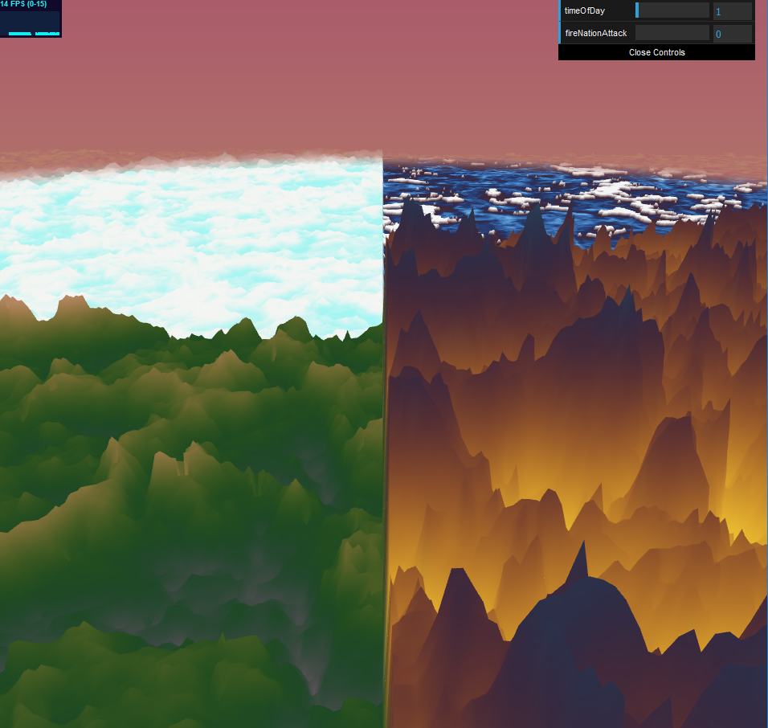
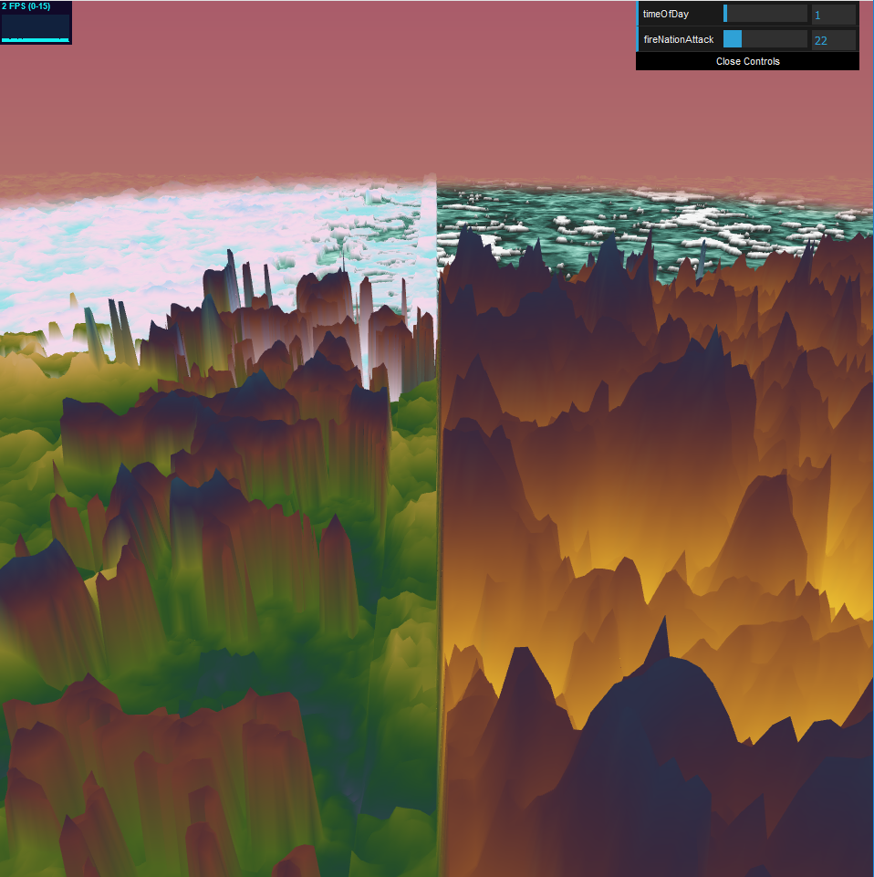
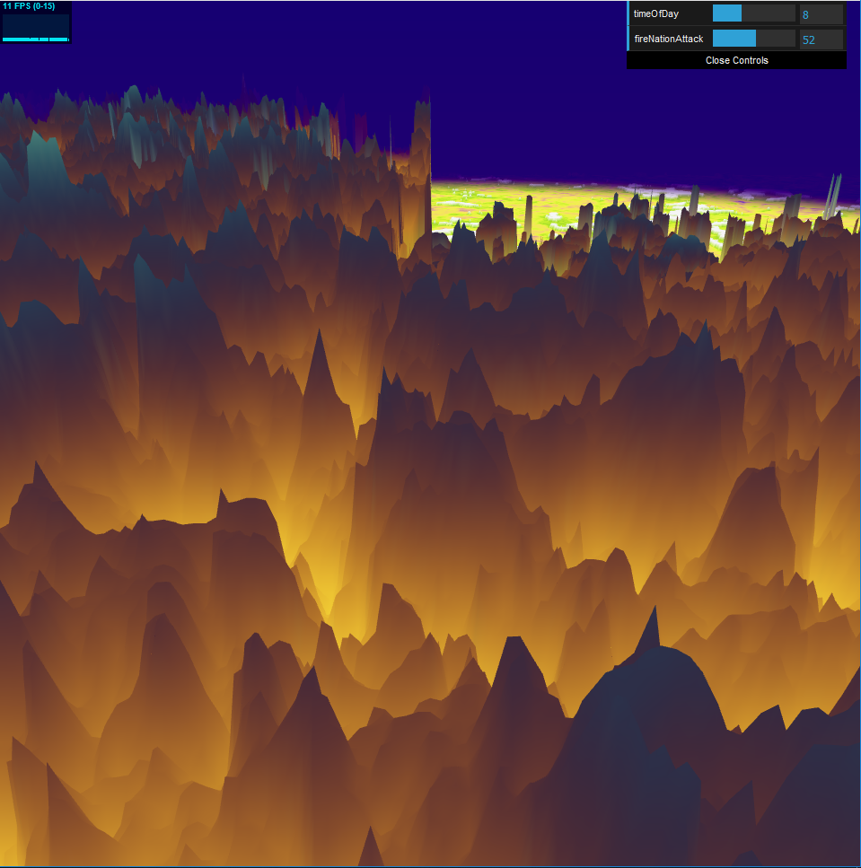
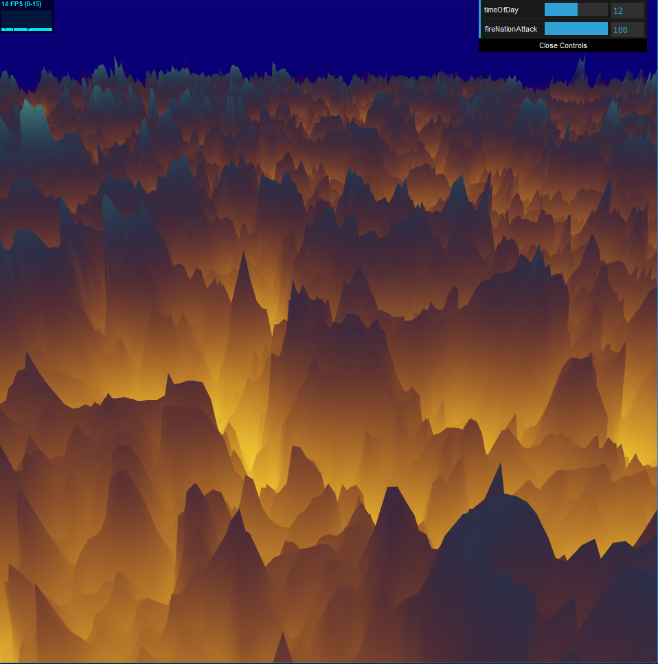

# Homework 1: Long Ago...
Jake Snipes

PennKey: jsnipes

## Images
The four nations lived together in harmony...

...but then...

...everything changed...

...when the Fire Nation attacked!

## Techniques
- All terrain was generated with 3D FBM noise
- Terrain style was differentiated by using different fall-off functions
- All terrain was colored based on a cosine color palette

### Air Nation (Top Left Quadrant)
- Square-root based FBM used to mimic clouds

### Water Nation (Top Right Quadrant)
- Texture generated using recursive FBM
- Height field flattened to mimic still water
- Snow coloring overlaid on recursive coloring based on height

### Fire Nation (Lower Right Quadrant)
- High frequency FBM to mimic craggy, intimidating mountains
- Adjusting the "fireNationAttack" GUI input represents years passing since Avatar Roku disappeared
- As you set more years to pass, the Fire Nation takes over the Air Nation then Earth Nation then Water Nation, enveloping the terrain in fiery mountains

### Earth Nation (Lower Left Quadrant)
- Height reduced to mimic smaller mountains

### Sky
- Cosine color palette used to color based on the "timeOfDay" GUI input
- Color is interpolated from bottom to top, using a future time's color at the top
- Distance fog recolored to blend with the sky's bottom color

## Live Demo
https://jacobsnipes.com/hw01-noisy-terrain

## Resources Used
Custom Cosine Color Palette Tool
- http://dev.thi.ng/gradients/

More Cosine Color Palettes (IQ)
- https://iquilezles.org/www/articles/palettes/palettes.htm

Noise Help (IQ)
- http://iquilezles.org/www/articles/warp/warp.htm

Hash Function Source (Mariano Merchante)
- https://github.com/mmerchante/playing-with-noise/blob/master/src/shaders/cloud.vert.glsl

I also received help from Emily and Adam!

